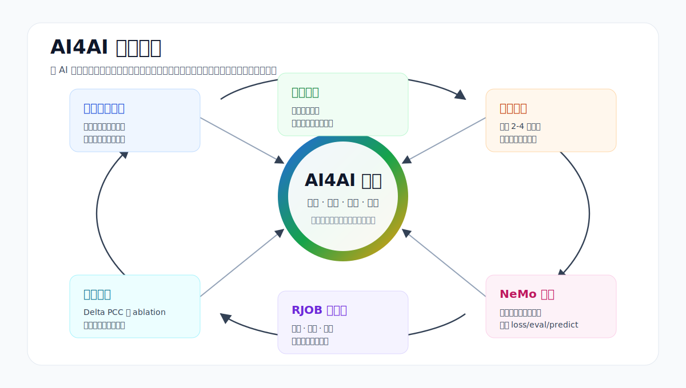
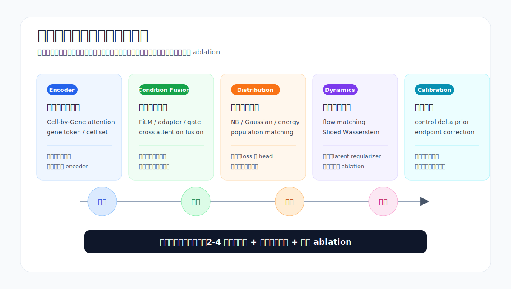
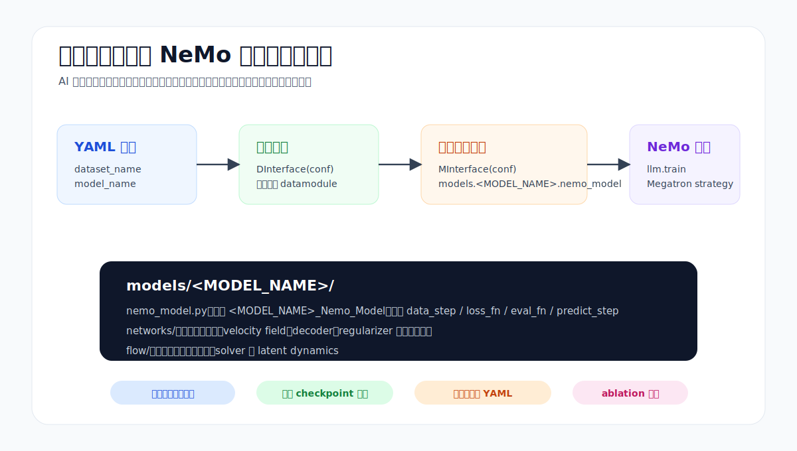
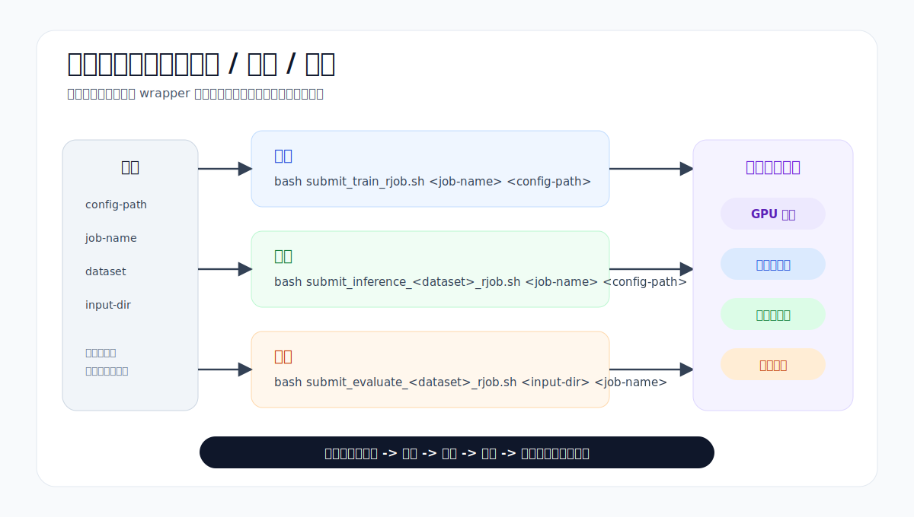
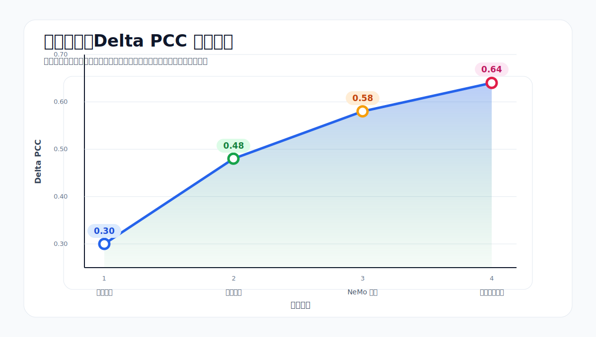

# AI4AI 驱动的细胞扰动预测模型设计

这个仓库以 AI4AI 为核心工作流：让 AI 阅读优秀代码仓库，蒸馏可迁移的算法原子，再按照本仓库的 NeMo/BioNeMo 训练规范组合成新的细胞扰动预测模型，并通过智算平台自动提交训练、推理和评估任务，形成可迭代的模型设计闭环。

主要参考资料：

- `AI4AI/loop/0_Distall_Papers.md`：从优秀 repo 中蒸馏算法原子设计。
- `AI4AI/loop/1_Design_Method.md`：把算法原子组合成本仓库可训练的新模型。
- `AI4AI/loop/2_Rjob_Submit.md`：用已有 wrapper 提交训练、推理和评估任务。
- `AI4AI/examples/stack_distill.md`：一个已蒸馏的算法原子库示例。
- `RJOB_SUBMISSION_RULES.md`：本仓库的 RJOB 提交约束。

## 1. 总体介绍：以 AI4AI 的方式设计细胞扰动预测模型



AI4AI 不是把外部方法简单复述成摘要，而是把优秀实现中的建模机制拆成可复用的算法原子，例如编码器、条件融合、分布建模、latent dynamics、distribution loss、inference calibration 等。每个原子都需要有代码证据、迁移价值、风险判断和最小 ablation 方案。

在本仓库中，一次完整迭代通常包括：

1. 读取外部优秀 repo 或已有蒸馏结果。
2. 提取可迁移的算法原子设计。
3. 在不破坏数据接口的前提下组合新模型。
4. 保持 NeMo/BioNeMo/Megatron 训练生命周期一致。
5. 自动提交训练、推理、评估任务。
6. 用 Delta PCC 等指标反馈下一轮设计。

## 2. 蒸馏优秀设计：原子设计卡片



蒸馏阶段的目标是得到“可选择、可组装、可验证”的算法原子卡片，而不是泛泛描述某个模型很强。以 `AI4AI/examples/stack_distill.md` 为例，可迁移的设计包括：

- Cell-by-Gene Tabular Attention：同时建模细胞内基因程序与跨细胞上下文。
- Rectangular Gene Masking：按基因列进行跨细胞 mask，学习模块级表达依赖。
- Distribution Head：用分布预测替代纯点预测，建模表达不确定性。
- Sliced Wasserstein Regularization：用分布正则约束 latent 几何。
- In-context Generation：利用上下文细胞支持目标状态生成。

这些卡片会作为后续模型设计的组件库。每个组件都要说明它解决什么问题、代码证据在哪里、如何落到 `models/<MODEL_NAME>/` 内、是否需要新增 batch 字段，以及最小 ablation 如何验证。

## 3. 设计模型：基于 NeMo，保持代码风格与仓库规范



新方法必须服从本仓库的训练接口，而不是另起一套普通 PyTorch 或独立 Lightning 流程。核心约束包括：

- 训练入口继续使用 `main_train.py`。
- 数据入口继续由 `dataset_name` 选择已有 datamodule。
- 模型入口继续由 `model_name` 动态导入。
- 新模型放在 `models/<MODEL_NAME>/`。
- 类名保持 `<MODEL_NAME>_Nemo_Model`。
- `loss_fn`、`eval_fn`、`predict_step` 与现有训练、推理、评估流程兼容。

这样做的好处是：AI 可以专注于结构性算法设计，例如条件编码、latent flow、分布损失、先验校准和推理修正；工程接口仍沿用统一规范，减少不可控改动。

## 4. 智算平台自动化：训练、推理、评估脚本提交



完成模型和配置后，任务通过已有 RJOB wrapper 提交，不为提交任务临时改代码或生成新脚本：

```bash
bash submit_train_rjob.sh <job-name> <config-path>
bash submit_inference_<dataset>_rjob.sh <job-name> <config-path>
bash submit_evaluate_<dataset>_rjob.sh <input-dir> <job-name>
```

自动化提交把“设计 -> 训练 -> 推理 -> 评估 -> 反馈”串成固定闭环。训练阶段使用 YAML 配置和 checkpoint 规则；推理阶段产出预测文件；评估阶段读取预测目录并汇总指标。下一轮 AI4AI 设计再根据指标变化决定保留、组合或替换哪些算法原子。

## 迭代收益：Delta PCC 持续提升



AI4AI 的价值不只在于自动写代码，而在于让模型设计变成可追踪的迭代过程。每轮都有明确假设、组件来源、实现落点和评估反馈。示意结果显示，Delta PCC 可以随迭代从 `0.30` 提升到 `0.48`、`0.58`，最终达到 `0.64`。
